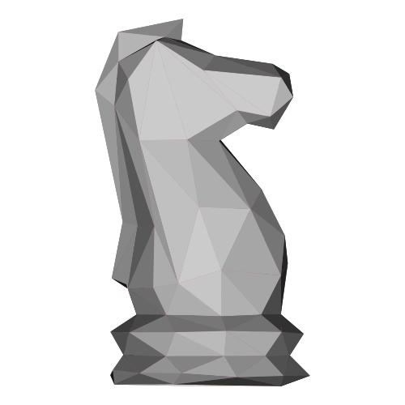

<!-- Improved compatibility of back to top link: See: https://github.com/Hart-House-Chess-Club/ratings-calculator/pull/73 -->
<a name="readme-top"></a>
<!--
*** Thanks for checking out the ratings-calculator. If you have a suggestion
*** that would make this better, please fork the repo and create a pull request
*** or simply open an issue with the tag "enhancement".
*** Don't forget to give the project a star!
*** Thanks again! Now go create something AMAZING! :D
-->


<!-- PROJECT SHIELDS -->
<!--
*** I'm using markdown "reference style" links for readability.
*** Reference links are enclosed in brackets [ ] instead of parentheses ( ).
*** See the bottom of this document for the declaration of the reference variables
*** for contributors-url, forks-url, etc. This is an optional, concise syntax you may use.
*** https://www.markdownguide.org/basic-syntax/#reference-style-links
-->
[![Contributors][contributors-shield]][contributors-url]
[![Forks][forks-shield]][forks-url]
[![Stargazers][stars-shield]][stars-url]
[![Issues][issues-shield]][issues-url]
[![GPL License][license-shield]][license-url]

<!-- PROJECT LOGO -->
<br />
<div align="center">
  <a href="https://github.com/Hart-House-Chess-Club/ratings-calculator">
    
  </a>

<h3 align="center">ratings-calculator</h3>

  <p align="center">
    Calculate ratings based on the CFC model!
    <br />
    <a href="https://github.com/Hart-House-Chess-Club/ratings-calculator"><strong>Explore the docs »</strong></a>
    <br />
    <br />
    <a href="https://github.com/Hart-House-Chess-Club/ratings-calculator">View Demo</a>
    ·
    <a href="https://github.com/Hart-House-Chess-Club/ratings-calculator/issues">Report Bug</a>
    ·
    <a href="https://github.com/Hart-House-Chess-Club/ratings-calculator/issues">Request Feature</a>
  </p>
</div>


<!-- TABLE OF CONTENTS -->
<details>
  <summary>Table of Contents</summary>
  <ol>
    <li>
      <a href="#about-the-project">About The Project</a>
      <ul>
        <li><a href="#built-with">Built With</a></li>
      </ul>
    </li>
    <li>
      <a href="#getting-started">Getting Started</a>
      <ul>
        <li><a href="#prerequisites">Prerequisites</a></li>
        <li><a href="#installation">Installation</a></li>
      </ul>
    </li>
    <li><a href="#usage">Usage</a></li>
    <li><a href="#roadmap">Roadmap</a></li>
    <li><a href="#contributing">Contributing</a></li>
    <li><a href="#license">License</a></li>
    <li><a href="#contact">Contact</a></li>
    <li><a href="#acknowledgments">Acknowledgments</a></li>
  </ol>
</details>


<!-- ABOUT THE PROJECT -->

## About The Project

![Rating Calculator[ratings-calculator]](src/ratings_calculator/assets/CFC_ratings_over_time.png)


This program was created to calculate CFC ratings for our members. A future implementation would be in embeding this
information onto a web service that will automatically calculate ratings. Another idea is to build a HHCC rating system
to let our members play each other in-person.

This program runs by calculating CFC ratings from the publicly accessible CFC algorithm viewable on
the [CFC handbook](https://github.com/Hart-House-Chess-Club/ratings-calculator/blob/main/docs/cfc_handbook.pdf). It also allows a user to visualize cfc ratings, calculate norms, and titles, and check ratings. 

A future goal is to use the public CFC API to connect to user's CFC ID and run various algorithms to automate the
finding user data aspect.

<p align="right">(<a href="#readme-top">back to top</a>)</p>


<!-- GETTING STARTED -->

## Getting Started

This is how you can get started using, developing, or configuring our project.

### Prerequisites

This is an example of how to list things you need to use the software and how to install them.

* python
  ```
  Python version 3.10 should be installed
  ```

* pip
  ```
  python get-pip.py
  ```
  - The latest version of pip available

* chess
  ```sh
  pip install chess
  ```
  - python library chess

* requests
  ```
  pip install requests
  ```
  - python library requests

![Rating Calculator[ratings-calculator]](src/ratings_calculator/assets/console_app_sample.png)


### Installation

Below is the installation process for running our code locally. 

1. Clone the repo
   ```sh
   git clone https://github.com/Hart-House-Chess-Club/ratings-calculator.git
   ```
2. Launch the program 
   ```
   python main.py
   ```

<p align="right">(<a href="#readme-top">back to top</a>)</p>


<!-- USAGE EXAMPLES -->

## Usage

This project is the beginning of many related projects part of the Hart House Chess Club's development of open-source Canadian chess software.


<p align="right">(<a href="#readme-top">back to top</a>)</p>


<!-- ROADMAP -->

## Roadmap

- [ ] Add program configuration onto a web service
- [ ] Add configuration for FIDE ratings. 
- [ ] Add configuration for API from chess.ca 
- [ ] Add configuration for chess.com api
- [ ] Add integration with lichess.org
- [ ] Multi-language Support (must be available in french for CFC)
    - [ ] French

See the [open issues](https://github.com/Hart-House-Chess-Club/ratings-calculator/issues) for a full list of proposed features (
and known issues).

<p align="right">(<a href="#readme-top">back to top</a>)</p>


<!-- CONTRIBUTING -->

## Contributing

Contributions are what make the open source community such an amazing place to learn, inspire, and create. Any
contributions you make are **greatly appreciated**.

If you have a suggestion that would make this better, please fork the repo and create a pull request. You can also
simply open an issue with the tag "enhancement". Don't forget to give the project a star! Thanks again!

1. Fork the Project
2. Create your Feature Branch (`git checkout -b feature/AmazingFeature`)
3. Commit your Changes (`git commit -m 'Add some AmazingFeature'`)
4. Push to the Branch (`git push origin feature/AmazingFeature`)
5. Open a Pull Request

<p align="right">(<a href="#readme-top">back to top</a>)</p>


<!-- LICENSE -->

## License

Distributed under the GPL License. See `LICENSE` for more information.

<p align="right">(<a href="#readme-top">back to top</a>)</p>


<!-- CONTACT -->

## Contact

Hart House Chess Club Executive Board
- [harthousechess.com](https://harthousechess.com) 
- [hhchess@studentorg.utoronto.ca](mailto:hhchess@studentorg.utoronto.ca)

Victor Zheng 
- [@victor-zheng-codes](https://github.com/victor-zheng-codes)

Project Link: [https://github.com/Hart-House-Chess-Club/ratings-calculator](https://github.com/Hart-House-Chess-Club/ratings-calculator)

<p align="right">(<a href="#readme-top">back to top</a>)</p>


<!-- ACKNOWLEDGMENTS -->

## Acknowledgments

* [Chess Federation of Canada](https://chess.ca)
* [lichess.org](https://lichess.org)

<p align="right">(<a href="#readme-top">back to top</a>)</p>


<!-- MARKDOWN LINKS & IMAGES -->
<!-- https://www.markdownguide.org/basic-syntax/#reference-style-links -->

[contributors-shield]: https://img.shields.io/github/contributors/Hart-House-Chess-Club/ratings-calculator.svg?style=for-the-badge

[contributors-url]: https://github.com/Hart-House-Chess-Club/ratings-calculator/graphs/contributors

[forks-shield]: https://img.shields.io/github/forks/Hart-House-Chess-Club/ratings-calculator.svg?style=for-the-badge

[forks-url]: https://github.com/Hart-House-Chess-Club/ratings-calculator/network/members

[stars-shield]: https://img.shields.io/github/stars/Hart-House-Chess-Club/ratings-calculator.svg?style=for-the-badge

[stars-url]: https://github.com/Hart-House-Chess-Club/ratings-calculator/stargazers

[issues-shield]: https://img.shields.io/github/issues/Hart-House-Chess-Club/ratings-calculator.svg?style=for-the-badge

[issues-url]: https://github.com/Hart-House-Chess-Club/ratings-calculator/issues

[license-shield]: https://img.shields.io/github/license/Hart-House-Chess-Club/ratings-calculator.svg?style=for-the-badge

[license-url]: https://github.com/Hart-House-Chess-Club/ratings-calculator/blob/master/LICENSE

[linkedin-shield]: https://img.shields.io/badge/-LinkedIn-black.svg?style=for-the-badge&logo=linkedin&colorB=555

[linkedin-url]: https://www.linkedin.com/company/Hart-House-Chess-Club/

[product-screenshot]: images/screenshot.png

